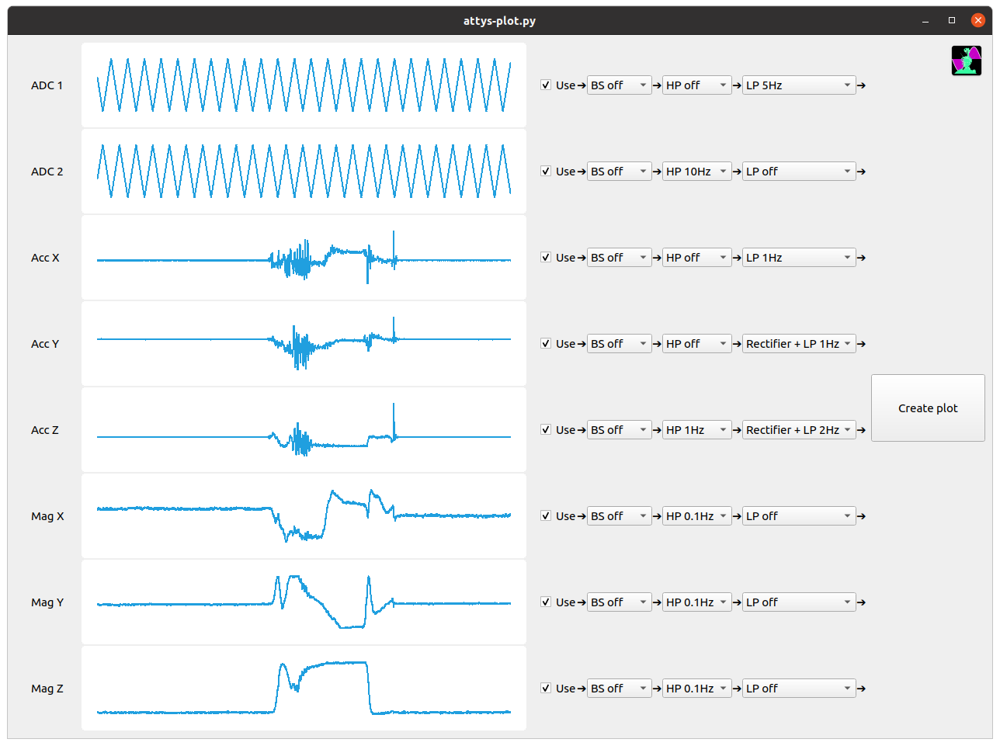
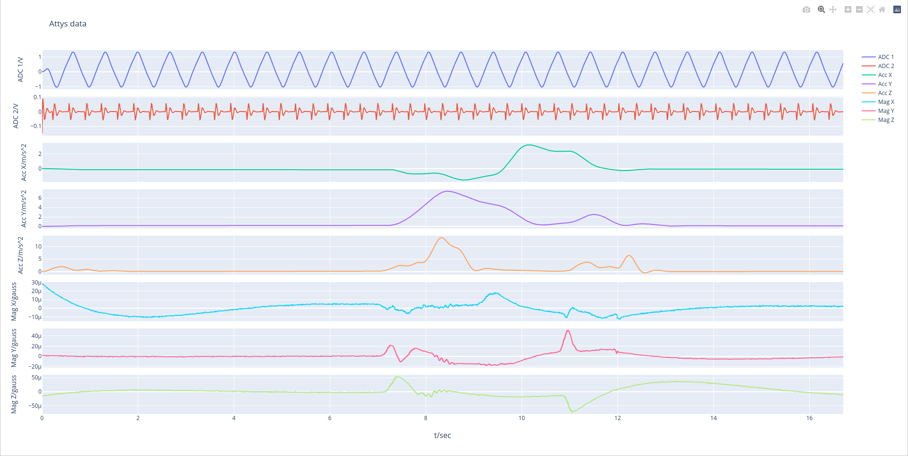

# attys-plot

Python script which filters and plots the tsv files recorded by
attys-scope (Desktop) or AttysScope (Android) and the
[Attys](http://www.attys.tech).

First load the raw unfiltered data. Then
select the filter functions such as low, high or bandstop
filters and plot the results.




## Python requirements

```
pip install PyQtChart
pip install plotly
```

## How to run

Just run `attys-plot.py` with:

```
python attys-plot.py
```

or from your favourite IDE.
