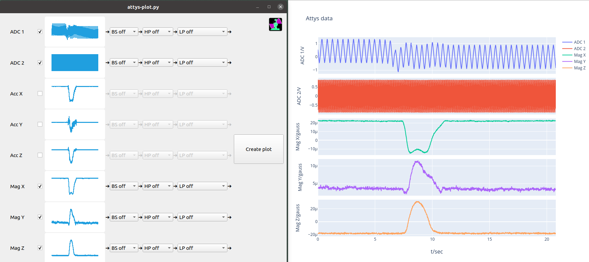

# attys-plot

Python script which filters and plots the tsv files recorded by
attys-scope (Desktop) or AttysScope (Android) and the
[Attys](http://www.attys.tech).



## Python requirements

```
pip install PyQtChart
pip install plotly
```

## How to run

Just run `attys-plot.py` with:

```
python attys-plot.py
```

or from your favourite IDE.

 1. Load the file recorded by attys-scope or AttysScope
 2. Select filter functions such as low, high or bandstop filters
 3. Plot the results
